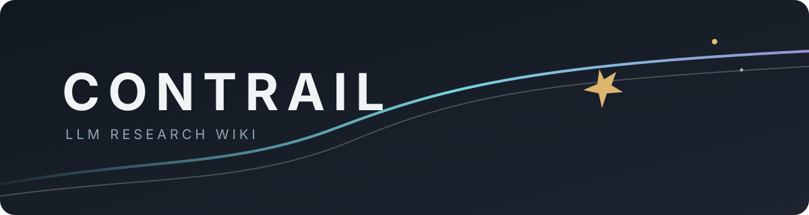

<div align="center">
  
  <p><strong>让散落的研究留下可循之迹。</strong></p>
  <p>一个面向 LLM / AI 研究与实践的轻量、证据导向 Wiki。</p>
  <p><code>source → note → concept → synthesis → experiment</code></p>
</div>

> **Contrail** 意为飞行轨迹，也取自《明日方舟》干员“云迹”。这里把每份来源、判断与实验连成可追溯的研究路径。

## 快速入口

| 开始研究 | 整理知识 | 维护 Wiki |
| --- | --- | --- |
| [[LLM-Wiki/index/home.md|主页导航]] | [[LLM-Wiki/concepts/|概念库]] | [[LLM-Wiki/metadata/workflows/README.md|标准工作流]] |
| [[LLM-Wiki/research/README.md|研究方向]] | [[LLM-Wiki/index/tags.md|标签索引]] | [[LLM-Wiki/metadata/conventions.md|编写规范]] |
| [[LLM-Wiki/raw/README.md|原始资料]] | [[LLM-Wiki/index/entities.md|实体索引]] | [[LLM-Wiki/CHANGELOG.md|修改记录]] |

## 核心原则

- **证据先行**：原始资料、来源陈述、综合判断与研究假设分层保存。
- **可以追溯**：关键事实回到来源，实验结论回到配置与原始输出。
- **持续沉淀**：论文笔记进入项目比较，跨来源知识进入可复用概念。
- **轻量维护**：Markdown、Obsidian WikiLink 与只读校验器组成最小工作流。

## 仓库地图

```text
LLM-Wiki/
├─ raw/          论文、网页快照与来源清单
├─ research/     论文笔记、比较、缺口与 Motivation
├─ concepts/     跨来源复用的概念实体
├─ experiments/  实验记录、原始输出与结果摘要
├─ index/        主页、标签与实体索引
├─ metadata/     Schema、规范与标准工作流
├─ templates/    可复制的文档模板
└─ changes/      复杂变更说明
```

## 如何使用

直接发起“阅读这篇论文”“调研某个方向”“运行这个实验”或“根据当前证据写 Related Work”。仓库中的工作流会负责路由、证据分层、索引更新与收尾校验。

<sub>视觉配色以雾白、冷青、暗紫与少量暖金构成，是对“云迹 / Contrail”意象的抽象化表达。</sub>
