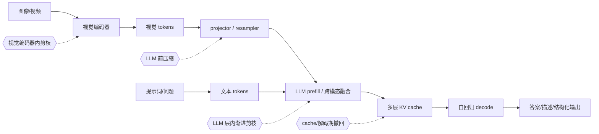

# 多模态 Token 剪枝

## 定义

多模态 Token 剪枝是在图像—文本模型的视觉编码、模态投影、跨模态融合或语言模型解码阶段，选择性删除、合并、凝聚或回收视觉/文本 token，以降低跨模态交互、LLM prefill、KV cache 和自回归解码成本，同时保留当前及后续任务需要的视觉证据。

它与纯视觉剪枝的本质差异是：**token 价值不再只由图像决定，而由图像、文本查询、融合位置、输出任务和对话历史共同决定。**

## 典型数据流与剪枝位置

| 位置 | 主要节省 | 能否利用文本 | 主要限制 |
|---|---|---|---|
| 视觉编码器内部 | 视觉 backbone 计算 | 需额外跨模态通路或先获得文本 | 架构耦合；空间结构风险 |
| projector / LLM 之前 | LLM prefill、KV、decode | 可 text-agnostic，也可额外算相似度 | 不减少视觉编码器成本 |
| LLM 浅/中层 | 后续 LLM blocks 与 KV | 可直接复用图文 attention | 已支付前几层成本；attention score 可能有偏置 |
| decode/cache 阶段 | 长输出每步注意力与 cache | 可随生成状态更新 | 动态策略开销、因果一致性和 batch 执行复杂 |

## 分类与生成的不同目标

| 维度 | 分类/检索/判别 | 自回归生成 |
|---|---|---|
| 输出 | 一个标签、匹配分数或短答案 | 变长 token 序列 |
| 相关性 | 通常由固定问题与固定 head 决定 | 会随已生成前缀和未来内容改变 |
| 主要成本 | 编码器与一次融合前向 | prefill + 每个输出 token 的 decode + KV cache |
| 错误传播 | 影响最终 decision boundary | 早期漏证据可能改变整条生成轨迹并诱发幻觉 |
| 评测 | accuracy、recall、VQA score | exact match/CIDEr/GPT judge、事实性、幻觉、长度与时延 |
| 多轮 | 常可为每个 query 重算 | 历史 KV 中已压缩的视觉表示可能无法支持新问题 |

## 相比纯视觉模型的新挑战

1. **查询条件化相关性：** 同一图像问“颜色”与“数量”需要不同 patch；TRIPS、PuMer、SparseVLM 都以文本指导视觉选择。
2. **覆盖与相关性的冲突：** 文本指导可能找对当前问题，却丢掉下一轮或未来生成需要的视觉证据；VisionZip 的 multi-turn 分析给出直接例子。
3. **多种 token 与融合拓扑：** visual/text/system/separator tokens 的信息密度、位置和作用不同，跨模态直接合并可能混淆表示；PuMer 因此采用 modality-aware merging。
4. **因果生成的未来相关性未知：** 在输出尚未生成时，无法精确知道第 $t+20$ 个词需要哪个视觉区域。
5. **KV cache 生命周期：** 视觉前缀会驻留在每层 cache；删 token 可减少 cache，但一旦缓存，后续轮次通常无法无损恢复。
6. **视觉证据与幻觉：** 删除小物体、文字、数字或关系 token 可能让语言先验接管，平均分不一定反映事实性恶化。
7. **位置偏置与注意力陷阱：** Wen et al. 发现 attention ranking 可偏向序列后部，random/pooling 在普通 benchmark 上反而更强；attention 不是可靠的普适真值。
8. **空间、时间与多图覆盖：** 高分辨率 OCR、小目标、多帧事件、多图对照要求保留低频出现但关键的 token。
9. **任务异质性：** 感知任务更需要 redundancy/coverage，知识推理更需要 prompt relevance；同一 selector 很难跨 benchmark 保持排序。
10. **系统指标分裂：** 视觉编码、prefill、TTFT、decode tokens/s、KV memory 和端到端 latency 的瓶颈不同；FLOPs 大降不保证长生成同比加速。

## 方法家族

- **文本指导的视觉选择：** TRIPS、PuMer、FastV、SparseVLM。
- **模态内合并/被删 token 回收：** PuMer、SparseVLM、VisionZip。
- **文本无关的覆盖与多样性：** VisionZip、DivPrune，适合复用和多轮但可能弱化当前 query 相关性。
- **配置/预算优化：** VisPCO 搜索层位置与保留率，不绑定单一 importance rule。
- **批判性基线：** Random、Pooling、spatial-window selection；它们是判断复杂 selector 是否真正有效的必要下界。
- **固定序列长度的深度注入：** DeepStack 不做 importance pruning；原始方法将额外高分辨率视觉 token 分组注入，Qwen3-VL 则注入多深度 ViT 中间特征。它是“删减视觉信息”之外的相邻效率与保真路线，并提示剪枝应联合考虑空间位置和表征深度。

## 评测最低要求

- 质量：普通 VQA/分类之外，至少加入 OCR/小目标、RefCOCO 定位、计数、幻觉/POPE、multi-turn 和视频时序。
- 效率：视觉编码时间、TTFT、prefill、decode tokens/s、端到端 P50/P95、峰值显存/KV cache，明确 batch、输出长度、硬件和 kernel。
- 基线：Random、uniform pooling、纯视觉 attention、文本指导 attention、diversity/merging、低分辨率或更小模型。
- 消融：同 token budget、同 FLOPs 与同真实 latency 三种口径分别比较。

## 证据边界

- 现有证据高度集中于“删除视觉 token 以加速图像/视频理解型 MLLM”；真正联合剪文本与视觉 token 的代表较少。
- 多数论文用短回答 benchmark；对长文生成、chain-of-thought、多轮长会话、跨硬件 P95 的证据仍不足。
- 本概念不涵盖仅剪权重、注意力头或仅压缩文本 KV cache 的工作。

## 关系与继续阅读

- 纯视觉基础：[[LLM-Wiki/concepts/technology/vision-transformer-token-pruning-basics.md|视觉 Transformer 与 Token 剪枝基础]]。
- 详细调研：[[LLM-Wiki/research/visual-token-pruning/multimodal-token-pruning.md|图文多模态 Token 剪枝调研]]。
- 项目总览：[[LLM-Wiki/research/visual-token-pruning/overview.md|视觉模型 Token 剪枝总览]]。
- 相邻概念：[[LLM-Wiki/concepts/methods/deepstack-visual-token-injection.md|DeepStack 视觉 Token 深度注入]]。
