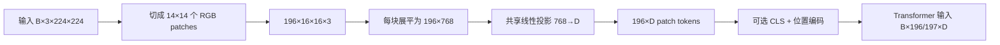
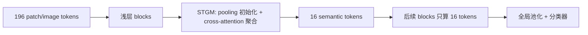

# 视觉 Transformer 与 Token 剪枝基础

> 阅读目标：建立从“图像如何变成 token”到“为什么、在哪里、怎样减少 token”的最小完整心智模型。本页以 STViT、Patch Slimming、Dyna-ViT 与 QuietPrune 为主要证据；凡超出论文直接陈述的通用解释，均标为“编者综合”。

## 1. 一句话定义

视觉 Transformer（ViT）把图像转换成一个向量序列，并让 Transformer 在这些向量之间交换信息；视觉 token 剪枝/压缩则在网络中途减少需要继续计算的向量数量，以换取更低计算量和更快推理，同时尽量保留任务所需信息。

## 2. Patch token 到底是什么

### 2.1 从像素块到向量

设输入图像为 $H\times W\times 3$，patch 边长为 $P$。把图像切成不重叠小块后，patch 数量为：

$$N=\frac{H}{P}\times\frac{W}{P}$$

每个 patch 不是只有 $P\times P$ 个数，因为 RGB 三个颜色通道都要保留。单个 patch 的原始形状是 $P\times P\times 3$，展平后的维度为 $3P^2$。随后使用可学习的线性投影

$$
z_i=x_iE+b,\qquad E\in\mathbb{R}^{(3P^2)\times D},
$$

把第 $i$ 个 patch 的像素向量 $x_i\in\mathbb{R}^{3P^2}$ 变成模型隐藏宽度为 $D$ 的向量 $z_i\in\mathbb{R}^{D}$。$z_i$ 才是送入第一个 Transformer block 的**初始 patch token**。这里的 $D$ 由模型配置决定，不必等于原始 patch 的像素维度。

以 $224\times224\times3$、patch size 为 $16\times16$ 的标准例子说明：

1. 图像被分成 $14\times14=196$ 个 patch；
2. 每个 patch 含 $16\times16\times3=768$ 个像素通道值；
3. 每个 patch 展平为一个 $1\times768$ 向量，而不是 $1\times256$；
4. 线性层把 $1\times768$ 投影为 $1\times D$；
5. 196 个投影结果组成 $196\times D$ 的 token 序列；
6. 若模型加入一个 `[CLS]` token，Transformer 的序列长度是 197，否则是 196；再考虑 batch 后，输入形状分别是 `[B,197,D]` 或 `[B,196,D]`。

在不带输入剪枝的标准 ViT 中，这 196 个 patch 都会经过 patch embedding，并全部进入视觉 Transformer。只有模型显式使用 pre-encoder pruning、动态 tokenization、区域裁剪或其他早期选择时，首个 Transformer block 才可能少于 196 个 patch tokens。



### 2.2 三个颜色通道如何处理

RGB 通道通常先分别按训练时使用的均值和标准差做归一化，然后作为同一个 patch 的三个输入通道共同参与 patch projection。它们不会默认生成三个 token，也不会先各自独立经过一套 Transformer。

从展平视角看，单个 patch 可以写成：

$$
x_i=[R_{1},\ldots,R_{256},G_{1},\ldots,G_{256},B_{1},\ldots,B_{256}],
$$

具体内存排列顺序由实现决定，但总维度都是 $16\times16\times3=768$。投影矩阵的每个输出维度都可以学习组合不同空间位置和不同颜色通道，因此能够响应边缘、颜色对比、纹理等局部模式。

实际代码通常不显式执行“切块→展平→Linear”，而使用一个等价的二维卷积：

```python
# 输入: [B, 3, 224, 224]
patch_embed = Conv2d(
    in_channels=3,
    out_channels=D,
    kernel_size=16,
    stride=16,
)

# 卷积输出: [B, D, 14, 14]
# 展平空间网格并交换维度: [B, 196, D]
```

卷积核形状为 `[D,3,16,16]`。对每一个 $16\times16$ 区域，它同时读取三个颜色通道并产生 $D$ 个输出值，正好等价于对长度为 768 的向量应用同一个线性投影。

### 2.3 Patch embedding 与视觉编码器的边界

“视觉编码器的输入”存在两种常见口径：

| 口径 | 输入张量 | 含义 |
|---|---|---|
| 整个 vision tower | `[B,3,H,W]`，或视频的 `[B,T,3,H,W]` | patch embedding 被视为视觉编码器的第一部分 |
| Transformer blocks | `[B,N,D]` | 图像已经完成切块、通道联合投影和位置编码 |

讨论 pre-encoder token pruning 时必须说明采用哪一种口径。在像素/patch embedding 之前选择区域，可以减少几乎整个视觉塔的计算；在 patch embedding 之后、第一个 Transformer block 之前删除 token，仍能减少所有自注意力 block 的计算，但 patch projection 已经执行。patch embedding 通常很便宜，主要成本仍在后续 blocks。

### 2.4 它不等于一个“物体”或一个“词”

- 初始 token 对应一个固定图像区域，但只是该区域的向量表示，不天然代表“猫”“车轮”等语义实体。
- 经过自注意力后，一个位置上的 token 已融合其他位置的信息，其有效感受野可以是全图；因此“第 10 层 token”不能简单理解为原 patch 的像素摘要。
- 论文常混用 **patch token** 与 **image token**。严格说，前者强调输入切块来源，后者可泛指视觉主干中的空间 token。
- **semantic token** 是 STViT 另行生成的聚类中心式表示：一个 semantic token 可以从多个 patch/image tokens 聚合信息，不再一一对应原始 patch。

### 2.5 常见 token 类型

| 类型 | 作用 | 能否直接按二维网格定位 |
|---|---|---|
| patch/image token | 表示局部图像区域并在层间更新 | 初始可；深层语义已混合，但索引通常仍保留空间位置 |
| class token | 汇总全局信息供分类头使用 | 否，属于全局汇总 token |
| position encoding | 不是独立视觉内容 token；为序列注入位置信息 | 提供位置参照 |
| window token | 局部窗口注意力中的 image token | 是，受窗口划分约束 |
| semantic token（STViT） | 从多枚 image token 聚合出的高层中心 | 仅通过初始化/注意力保留弱空间关联，不等于原网格 |

## 3. ViT 的基本结构

### 3.1 标准全局 ViT / DeiT 心智模型

1. **Patch embedding：** 图像 → $N$ 个 $C$ 维 token。
2. **位置与特殊 token：** 加 position encoding；部分架构加入 class token。STViT 实验的分类头则对最后一层输出 tokens 做 global average pooling。
3. **重复 Transformer block：**
   - LayerNorm；
   - Multi-Head Self-Attention（MSA）：每个 token 生成 query/key/value，与其他 token 交互；
   - residual connection；
   - LayerNorm + 两层 MLP/FFN；
   - residual connection。
4. **任务头：** 分类头、检测 neck/head、分割 decoder 等。

全局自注意力让每个 token 与所有 token 交互，注意力矩阵大小约为 $N\times N$。STViT 补充材料 §A.2 将单层全局 MHA 复杂度写为 $4NC^2+2N^2C$，FFN 为 $8NC^2$：减少 token 不只削减注意力二次项，也削减 FFN 的线性项。

### 3.2 局部/分层 ViT / Swin 心智模型

Swin 把注意力限制在固定窗口内，并通过 shifted/cross-window 连接交换窗口间信息；还用 patch merging 逐 stage 降低空间分辨率、增加通道。其注意力对全局 token 数近似线性，但窗口内空间规则性非常重要。

**为什么这影响剪枝？** 如果随意删掉某些位置，剩余 token 不再组成规则窗口，局部注意力、shifted window 和下采样都难以直接执行。STViT 因此不是保留不规则 patch 子集，而是在每个窗口生成固定数量的 semantic token。

## 4. 视觉任务类型与 token 需求

| 任务类型 | 典型输出 | 对 token 的核心要求 | 剪枝风险 |
|---|---|---|---|
| 图像分类 | 整图一个类别 | 全局语义最重要 | 相对最能容忍空间细节丢失 |
| 视频分类/动作识别 | 视频级类别 | 空间语义 + 时间一致性 | 每帧/时序 token 过度压缩会漏掉短暂动作 |
| 目标检测 | 框、类别 | 全局上下文 + 可定位的多尺度特征 | 小目标和边界可能随 token 丢失 |
| 实例分割 | 每个实例的像素掩码 | 检测要求 + 边界细节 | 恢复后的 token 可能缺少真实高频细节 |
| 语义分割 | 每像素类别 | 密集空间对齐、边界与高频信息 | 最容易暴露“语义保留但细节消失” |

论文直接证据说明这种任务差异：STViT 在 ImageNet 用 16 个 semantic tokens 可保持 DeiT 精度（Table 1），STViT-R 在 COCO 可保持 box/mask AP 且 backbone FLOPs 下降 31%–32%（Table 5），但在 ADE20K 语义分割仍下降 0.8–1.0 mIoU（补充材料 §A.4，Table 5）。因此“分类不掉点”不能自动推导为“密集任务不掉点”。

## 5. 训练流程：模型如何学会任务与剪枝

### 5.1 普通 ViT 训练


训练阶段需要保存反向传播所需中间激活，通常比纯推理占更多显存。任务损失决定 token 表示要保留什么：分类损失偏向全局判别语义，像素级损失要求空间细节。

### 5.2 加入 token 压缩后的训练

方法需回答三个问题：

1. **何时减？** 浅层、深层，还是多次渐进压缩？越早减，节省越大，但浅层 token 语义尚未稳定。
2. **减哪些/怎么减？** 删除低分 token、合并相似 token、聚类凝聚为新 token，或规则池化。
3. **是否可微？** 固定规则可直接推理；可学习 selector、rate 或 semantic token 通常需要微调/重训，离散删除还可能使用近似梯度或额外策略。

STViT 的选择是：先用若干普通层形成低层特征，再让两层 STGM 用 attention 学习 semantic centers，随后丢弃原 image tokens。其 ImageNet 模型从头训练 300 epochs、无知识蒸馏（§4.1），所以它不是无需训练地插入任意预训练 ViT。

## 6. 推理流程：真正节省发生在哪里

### 6.1 普通推理

推理只做前向传播，不计算梯度：图像 → patch tokens → 全部 blocks → 任务头 → 输出。延迟由模型计算、内存访问、kernel 调度、输入预处理和后处理共同决定。

### 6.2 STViT 示例



对于密集任务，STViT-R 在一段 semantic-token 计算后，用 recovery cross-attention 恢复规则空间 token，再进入检测/分割组件。节省来自较长的“低 token 区间”，成本来自 STGM、恢复、窗口重排和额外内存访问。

### 6.3 FLOPs 不等于时延

- FLOPs 只数理论算术量，不反映小矩阵利用率、访存和动态 shape。
- throughput（images/s）受 batch size 影响；大 batch 的提升不代表 batch=1 latency 同比例下降。
- 比较时至少记录：任务质量、FLOPs、batch=1 P50/P95 端到端时延、固定 batch throughput、峰值显存、压缩模块开销、硬件与软件版本。

STViT 的吞吐在 V100、batch=128 测量，因此它能证明该设置下存在真实加速，但不足以证明所有部署环境都有同等收益。

### 6.4 固定输入分辨率时，每层计算量是否不变

**编者综合：基本正确，但“分辨率不变”本身不是充分条件。** 对标准、等宽、全局注意力 ViT，若以下条件同时成立：

1. 输入分辨率、patch size 与 stride 不变，因此初始 token 数 $N$ 不变；
2. patch embedding 前后以及各个 block 内都不做 token 删除、合并、池化或动态 tokenization；
3. 不做 early exit、跳层或按样本改变注意力模式；
4. 各 block 的隐藏宽度、头数和 MLP expansion 等结构相同；

那么每个 block 接收的张量形状都为 `[B,N,D]`，其理论计算量基本相同。输入内容会改变注意力数值，却不会改变标准 dense kernel 要执行的矩阵形状。单层全局 MHA 的主要项为 $4ND^2+2N^2D$，FFN 的主要项与 $ND^2$ 成正比；只把某些 token 乘零或盖上 mask、但仍保留 `[B,N,D]`，通常不会得到相应的 dense FLOPs 或时延下降。

这个结论不适用于本身会 patch merging 的分层 ViT、局部/窗口注意力、宽度不同的 stage，或会在层间真正缩短序列的模型。即使每个已执行 block 的 token 数不变，early exit 或缩短深度仍可降低**总**计算量。

### 6.5 Patch embedding tokens 能否直接剪枝

可以。patch tokens 不是像自回归文本生成那样按顺序逐个送入编码器；一层自注意力会并行接收整个 `[B,N,D]` 序列，并形成尺寸与 $N$ 有关的 $Q/K/V$ 和注意力矩阵。所谓“直接剪 embedding token”，是先得到候选 token 的分数或索引，再把张量实际 gather/pack 成 `[B,K,D]`（$K<N$），让后续 block 只处理保留序列。

| 剪枝位置 | 哪些计算仍处理全部 $N$ 枚 token | 主要优点 | 主要限制与已有先例 |
|---|---|---|---|
| patch projection 之前 | 轻量像素/patch scorer；被保留 patch 才做后续投影 | 理论节省最大 | scorer 必须比省下的计算便宜；原始像素显著性未必等于任务证据 |
| patch embedding 之后、首个 block 之前 | patch projection 已处理 $N$；所有 Transformer blocks 只处理 $K$ | patch projection 通常便宜，几乎完整保留视觉塔内的 token 加速 | Dyna-ViT 已用无参显著性做 pre-encoder Top-K，因此“首层前剪 token”本身不是空白 |
| 第 $l$ 个浅层 block 之后 | 前 $l$ 层处理 $N$，后续层处理 $K$ | token 已具备更多上下文，评分通常更可靠 | 越晚剪，视觉塔时延收益越小；Patch Slimming、QuietPrune 与大量动态剪枝方法属于这一邻域 |
| 完整视觉塔之后、LLM/projector 之前 | 整个视觉编码器都处理 $N$ | 易插入现有 VLM，可减少 projector/LLM prefill | 不降低视觉编码器计算量 |

实现时还需处理三个细节：

- **位置不能被重新编号成错误语义。** 使用绝对位置向量时，应一起 gather 原 token 及其原位置编码；使用二维 RoPE/M-RoPE 时，应保留原网格坐标。token merging 则需定义合并后的位置。
- **mask 不等于剪枝。** 若只是将被删 token 的注意力权重设为零，Q/K/V 投影、FFN 和多数矩阵乘仍按 $N$ 执行。需要真实缩短张量，或使用确实跳过这些元素的稀疏 kernel。
- **动态长度未必带来真实时延收益。** 同一 batch 内每张图保留数不同，常被 padding 回最大长度；固定 $K$、少量预算档位，或支持 packed/ragged sequence 的 kernel 更容易获得稳定加速。

当前已有工作说明三条路径都可行：Dyna-ViT 在 encoder 前用无监督显著性代理选择 Top-K patch，保持标准 ViT 主干；Patch Slimming 用深层有效 patch 反向指导更早层的选择；QuietPrune 把文本 query 映射到视觉域，在 ViT 内做查询引导的早剪。对图文安全判别而言，真正仍需验证的不是“embedding token 能否剪”，而是：如何在首层或极浅层仅用很小代价识别**低显著度、小区域、OCR 或依赖文本/政策语境的危险证据**，并让训练后的模型在这些难例上保持召回。通用显著性 Top-K 和“把 query 换成安全 policy”都已有直接近邻，不能单独构成论文贡献。

## 7. “剪枝”不是一种单一操作

| 家族 | 操作 | 信息命运 | 典型风险 |
|---|---|---|---|
| token pruning / dropping | 选择一部分 token 继续运行 | 被删 token 多数不可逆丢失 | 高压缩下精度和空间覆盖下降 |
| token merging | 将相似 token 合并 | 部分信息以聚合形式保留 | 匹配/合并算子有开销，位置需加权处理 |
| token condensation / semantic tokens | 从全体 token 生成少量新代表 | 信息被重新编码为中心式表示 | 需要训练/架构改造，细节可能被低通化 |
| token recovery | 从压缩表示恢复规则分辨率 | 恢复的是估计特征，不是原信息无损回放 | 密集边界与高频信息仍可能缺失 |

**编者综合：** STViT 论文自称 token sparsification，但从操作语义看更接近“attention-based condensation + replacement”；把它与纯删除方法放在同一张表时，应明确这一差异。

## 8. 用 STViT 理解一次完整设计

1. **输入语义尚浅：** 先保留 4 个 DeiT blocks 处理 196 tokens。
2. **生成代表：** 空间池化让 16 个初始中心覆盖不同区域；attention 再按内容聚合，global centers 补充全局语义。
3. **缩短序列：** 原 196 tokens 退出后续计算，余下 6 层只处理 16 tokens。
4. **分类：** 最后 tokens 做全局平均池化并线性分类。
5. **密集任务：** 周期性把 semantic token 信息写回规则 image-token 网格。
6. **证据：** 16-token DeiT-T/S/B 在论文设置内分别获得 +101%/+105%/+110% throughput、-58% FLOPs且 Top-1 不变（Table 1）。
7. **边界：** Swin 每窗口压到 4 tokens 时 T/S/B 均下降约 0.5–0.6 Top-1；ADE20K 仍下降 0.8–1.0 mIoU。

## 9. 初学者常见误区

1. **“token 越少一定越快。”** 错；压缩/排序/合并成本和硬件利用率可能吃掉收益。
2. **“attention 是 $N^2$，所以 token 减半就必然快四倍。”** 错；投影与 FFN 对 $N$ 近似线性，实际 kernel 也不是纯注意力矩阵乘。
3. **“patch token 永远只含原 patch 信息。”** 错；深层 token 已通过 attention 融合上下文。
4. **“恢复分辨率等于恢复被删细节。”** 错；recovery 只能从保留表示估计空间特征。
5. **“分类精度不变就说明剪枝无损。”** 错；分类标签可能不要求边界、小目标或像素级细节。
6. **“所有 ViT 都可使用同一 selector。”** 错；全局 ViT、窗口 ViT 和视觉 SSM 的结构约束不同。
7. **“semantic token 就是挑出来的重要 patch。”** 错；STViT semantic token 是多个 tokens 的可学习聚合中心。
8. **“16×16 patch 展平后是 256 维。”** 错；RGB 图像还包含 3 个颜色通道，因此是 $16\times16\times3=768$ 维。
9. **“196 个 patch 就是 196×768 个参数。”** 错；这是当前样本的输入数值。所有 patch 共享同一个 $768\times D$ 投影矩阵，参数量不会乘以 196。
10. **“patch tokens 是按空间顺序逐个输入注意力。”** 错；一个 block 通常并行接收完整 token 序列，序列索引和位置编码只说明位置关系。
11. **“把不重要 token mask 为零就已经省掉计算。”** 错；对标准 dense kernel，张量长度没有真正缩短时，主要矩阵乘通常仍会执行。

## 10. 阅读剪枝论文的检查清单

- 原始 token 数如何计算？是否含 class/distillation tokens？
- 哪些层减 token？每层/每样本预算是多少？
- 操作是删除、合并、凝聚还是恢复？空间位置怎样维护？
- 方法需从头训练、微调还是完全免训练？
- 任务是分类还是密集预测？质量指标是否对应任务？
- FLOPs 是否包含 selector/merger/recovery？
- 是否报告同硬件、同 batch、同精度下的端到端时延？
- 动态长度是否真正由高效 kernel 支持？
- 失败条件、最小目标、边界和高频细节是否测试？

## 11. 关系与继续阅读

- 研究路线、方法比较与证据入口：[[LLM-Wiki/research/visual-token-pruning/multimodal-safety-token-pruning-research-plan.md|多模态安全判别 Token 剪枝研究方案]]。

## 12. 证据限制与待办

- 本页只用 STViT、Patch Slimming、Dyna-ViT 与 QuietPrune 搭建入门模型和早剪位置边界，不声称覆盖 ViT 与 token 剪枝的全部历史定义。
- 本次补充的张量形状、RGB 通道投影和 Conv2d 等价解释属于通用实现说明；ViT/DeiT/Swin 的原始论文尚未分别登记为本概念的直接来源。若用于教材或正式论文引用，应后续补齐一手来源并按 paper-ingestion 流程核验。
- 没有本地复现实验，所有数值均为作者报告。
